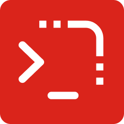

<picture></picture>

# Terminal Recipes

    

**Organize, run, and generate terminal commands with variables, favorites, and a built-in AI assistant.**

---

Terminal Recipes gives you a central panel inside VS Code to store and run your frequently used terminal commands. Organize them by category and group, define reusable variables, and execute them with a single click across every project you work on.

---

## Previews

> _(Screenshots and GIFs coming soon - stored in `docs/images/`)_

---

## Key Features

### 📂 Categorized Command Management

Organize commands into **categories** and **groups** (e.g. MySQL → Setup, Build, Deploy). Create, rename, and delete both. Filter the command table by category and group, toggle visible columns, and drag rows to reorder them within a group.

### ⚡ Three Ways to Run a Command

| Action   | What it does                                                               |
| -------- | -------------------------------------------------------------------------- |
| **Run**  | Executes the command immediately (with a confirmation dialog)              |
| **Use**  | Pastes it into the terminal input so you can review or edit before running |
| **Copy** | Copies the resolved command to your clipboard                              |

### 🔤 Variables - Three Independent Scopes

Add `${variableName}` placeholders to any command template. When you run or use a command, a dialog prompts you to fill in the values.

Each variable can be saved in one of three independent scopes:

| Scope      | Saved to                                    | Best for                               |
| ---------- | ------------------------------------------- | -------------------------------------- |
| **Local**  | `.vscode/terminal-recipes.variables.json`   | Values that differ per project         |
| **Global** | `~/.vscode-terminal-recipes/variables.json` | Values shared across all projects      |
| **Off**    | Session memory only - never written to disk | One-time values you don't need to keep |

Switching the scope toggle never deletes the value stored in the other scopes.

**Auto Variables** (`${date}`, `${username}`, `${workspaceFolder}`, `${workspaceName}`) resolve automatically without any input.  
**Enum Variables** let you predefine a fixed list of options that appear as a dropdown at run time.

> **Multi-Root Workspaces:** A workspace folder selector appears in the panel header when working with a multi-root workspace. Local variables, local favorites, and auto variables like `${workspaceFolder}` automatically reflect the selected folder. The Run confirmation dialog also includes a per-execution folder override that sets the terminal's working directory.

### 🤖 AI Assistant

Generate and understand commands without leaving VS Code:

- **Generate**: Describe what you need in plain language and the AI produces a set of ready-to-insert commands.
- **Explain**: Click the Explain button on any command to get a structured breakdown: what it does, what each part means, practical examples, and warnings.

**8 AI providers supported:** Google Gemini · OpenAI · Anthropic Claude · DeepSeek · Groq · Mistral AI · Cohere · StepFun

> Several providers offer **free tiers** - Gemini, DeepSeek, and Groq are good starting points.

### ⭐ Favorites & Recent Commands

- **Favorites**: Mark any command as a favorite with Global or Workspace scope. Quick-add with a single click, or Ctrl+click to manage the scope. Jump back to the original command from the Favorites tab at any time.
- **Recent**: Every command you run is tracked automatically. Revisit or re-run recent commands without searching the full list.

---

## What's New in v1.0.0

- 🤖 AI command generation and explanation with 8 provider options (including free tiers)
- ⭐ Favorites system with Global and Workspace scope
- 🔤 Three-scope variable system (Local / Global / Off) with per-variable independent storage
- 📋 Enum Variables - predefine fixed option lists for any variable

To check the full changelog [click here](CHANGELOG.md).

---

## Requirements

- VS Code `1.86.0` or later.

## Getting Started

1. Install the extension from the VS Code Marketplace.
2. Open the panel:
   - **Command Palette** → `Terminal Recipes: Open Panel`
   - **Keyboard shortcut** → `F4 F4` (press F4 twice)
3. Create a category and optionally add groups.
4. Add your first command with a template.
5. Click **Run**, **Use**, or **Copy** to execute it.

## Keyboard Shortcut

| Shortcut | Action                          |
| -------- | ------------------------------- |
| `F4 F4`  | Open the Terminal Recipes panel |

---

## Documentation

- [Settings Reference](docs/settings.md) - all configuration options explained
- [Frequently Asked Questions](docs/faqs.md) - common questions and troubleshooting

---

## License

[MIT](LICENSE)
